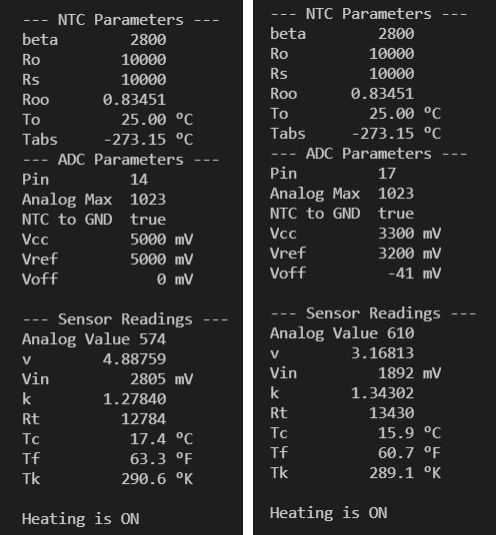
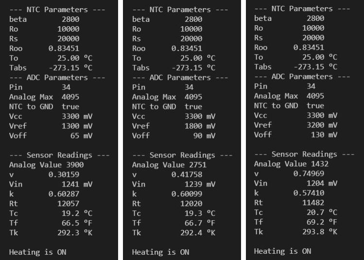

# NTCthermostat
Shows how to realize a thermostat with a NTC resistor

Maybe you also have some of these strange components in your tinkering box, 
which you removed from a defective battery pack or an old PC power supply. 
These are NTC resistors, i.e. resistors with a negative temperature 
coefficient. Their resistance therefore decreases with increasing temperature. 
They are suitable for temperature measurement or, as the title of this project 
says, for building a thermostat. 


## Some Formulas
If we connect an NTC resistor in series with another resistor whose value we 
know, we can measure the voltage at this voltage divider and calculate the 
unknown resistance value of the NTC from it. We can set up the voltage divider 
in two different ways, namely connect the NTC to ground or to Vcc. 
```
  ---+-- Vcc                            ---+--- Vcc
     |                                     |
    .-.                                   .-. 
    | | Rs                                |\| NTC
    '-'                                   '-' 
     |                                     | 
     +---> analog input                    +---> analog input
     |                                     |   
    .-.                                   .-.
    |/| NTC                               | | Rs
    '-'                                   '-'
     |                                     |
  ---+--- GND                           ---+--- GND
```
If we assume that the ADC (analog to digital converter) of our microcontroller delivers the value Aval between 0 and Amax (e.g. 0..1023), for input voltages 
from 0V to Vcc , the resistance of the NTC for the two cases is calculated as 
follows: 
```
  Rt = Rs * Aval / (Amax - Aval)        Rt = Rs * (Amax - Aval) / Aval
    or with                               or with
  k = (Amax -Aval) / Aval               k = (Amax -Aval) / Aval 
    = Amax/Aval - 1                       = Amax/Aval - 1
    we get                                we get
  Rt = Rs * 1/k (NTC to GND)            Rt = Rs * k (NTC to Vcc)
```
Now we know the resistance of the NTC. But how do we calculate the temperature 
from this? The formula of Steinhart-Hart helps us here ( [see NTC](http://www.resistorguide.com/ntc-thermistor/#Voltage-current_characteristic) ) : 
```
  R(T) = Ro * exp(BETA * (1/T - 1/To)  Steinhart–Hart equation
  ===================================  
  To     Nominal temperature, normally 25°C 🚩 for calculations use degrees Kelvin 🚩
  Ro     Resistance of the NTC resistor at nominal temperature R(To)
 
  Roo  = Ro * exp(-BETA / To)          Resistance for T --> oo

  Rt   = Roo * exp(BETA / T)           Resistance at temperature T
  
  T    = BETA / ln(Rt / Roo)           Temperature as a function of measured resistance
```
In the Steinhart-Hart equation BETA denotes the characteristic parameter of the NTC. 
It can be taken from the data sheet of the NTC or calculated from 2 resistance 
measurements at different temperatures: 
```
         T2 * T1
  BETA = ------- * ln(R1 / R2)         R1, R2 measured resitance values at 
         T2 - T1                       two different temperatures T1, T2	
```

## Comparing the Analog to Digital Converters on different boards
### Arduino Uno
The ADC of the Arduino Uno maps the full input range 0..5V to the range 0..1023

### Wemos D1
The ADC of the ESP8266 has an input range of 0..1V which is mapped to 0..1023. But the Wemos D1 has an internal voltage divider 220k/100k with midpoint connected to the ADC and the 220k-endpoint connected to pin A0. Therefore the input voltage to convert at A0 must not exceed 3.2V to get the full range.

### ESP32 DevKit
The ADC of the ESP32 has selectable attenuations for different 
reference voltages. It maps the input voltage to the range of 0..4095.
 Unfortunately the ADC also has a certain offset voltage which we have 
 to consider ( [see ADC ESP32](https://people.eecs.berkeley.edu/~boser/courses/49_sp_2019/N_gpio.html) ) :
```
Attenuation   ADC_0db   ADC_2_5db   ADC_6db    ADC_11db (default)
Vref          1100mv    1300mv      1800mv     3200mv
Voff          65mv      65mv        90mv       130mv
```
We can express this relationship with a linear equation:
```
Vin = Aval * v + Voff  with  v = (Vref - Voff) / Amax
```
If we look at the series connection of Rs and Rt we see that Vin = Vcc * Rt / (Rs + Rt) if the NTC is connected to GND, or Vin = Vcc * Rs / (Rs + Rt) if Rt is connected to Vcc. So for the two cases we get for the resistance value of the 
NTC to GND: Rt = Rs * k or
NTC to Vcc: Rt = Rs / k with
k = Vin / (Vcc - Vin)

So with this knowledge, we can connect the network Rs/Rt to any voltage Vcc as long as we keep the input voltage Vin smaller than the reference voltage Vref of the ADC.

## Design Steps
From the considerations made, we see that quite a lot of parameters have to be taken into account. Therefore we pack these into two structures, one for the NTC and one for the ADC. Further, we take into account that the attenuation only applies to the ESP32. 
```
using ParamsNTC = struct paramsNtc { 
      uint16_t Rs; 
      uint16_t Ro; 
      uint16_t beta; };

#ifdef ESP32
  using ParamsADC = struct parmsAdc{ 
        uint8_t pin; 
        bool ntcToGround; 
        uint16_t Amax; 
        adc_attenuation_t att; 
        double Vcc; 
        double Vref; 
        double Voff; };
#else
    using ParamsADC = struct paramsAdc { 
          uint8_t pin; 
          bool ntcToGround; 
          uint16_t Amax; 
          double Vcc; 
          double Vref; 
          double Voff; };
#endif
}
```
Now we are able to design two classes, one for the NTC sensor, the other for the thermostat. The constructor of the `NTCsensor` class takes two references as arguments, one to the NTC, the other to the ADC parameters. The member variables are initialized, the pin mode of the analog input pin is set and the constant Roo is calculated. 
```
class NTCsensor
{
  public:
    NTCsensor(ParamsNTC &ntc, ParamsADC &adc)  : _ntc(ntc), _adc(adc)
      {
        pinMode(_adc.pin, INPUT);
        #ifdef ESP32
          analogSetAttenuation(_adc.att);
        #endif
        // calculate the resistance of the NTC for T --> oo
        _Roo = _ntc.Ro * exp(-(double)_ntc.beta / (_To - _Tabs)); 
      }
```
Of course, we would like to be able to query the temperature in °C, °F and °K and 
also output the parameters of the NTC. The corresponding methods are provided for 
this purpose.

A thermostat is really nothing more than a switch that triggers appropriate actions 
at certain temperatures. That is why we pass to the constructor of the `NTCthermostat` 
class only a reference to a sensor object and the references to 3 callback functions.
onDataReady() is called every loop interval, the other two callbacks only when the 
corresponding lower or upper temperature limits are reached. 
```
using Callback = void (&)();

class NTCthermostat
{
  public:
    NTCthermostat(NTCsensor &ntcSensor, Callback onLowTemp, 
                  Callback onHighTemp,  Callback onDataReady) : 
                  _ntcSensor(ntcSensor), _onHighTemp(onHighTemp),
                  _onDataReady(onDataReady) {}
```
The temperature is measured periodically in the loop() method. The measurement 
interval and the two temperature limits are set with corresponding methods. All 
other details can be seen in the code. The program compiles for Arduino UNO R3, 
Wemos D1 R2 and DoIt ESP32 DevKit V1 by simply switching the ***PlatformIO Project Environment***.

## User Interface
The program simply outputs the parameter settings and the measured 
values periodically. The displayed outputs show that the measured 
values differ considerably from board to board.

---
Output for UNO R3 and Wemos D1



---

Output for ESP32 ADC_2_5db / ADC_6_db / ADC_11db


